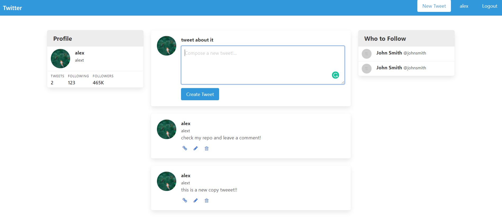

# Twitter Clone

## Description

This is a practice on Ruby on Rails on how to create a twitter clone.
The goal was to create a very similar-looking page as Twitter and the ability to create tweets with a personal account.
The app does not include the functionality to follow people and to be followed.

## Images

## Built and tested With

- Ruby 2.7.0
- Ruby on Rails 6.1.0
- sqlite3

## Pre requirements

Have a pc using Linux, MacOS or Windows Using WSL.
Have Ruby and Ruby in Rails installed already.
Have nodejs installed. 

## Usage

In order to use and try the app you have to follow the next steps:

Download the repository with this command:

`git clone https://github.com/alejandrotoledoweb/twitter_clone.git`

Then run this command to install all the dependencies:

`bundle install`

Now, we need to migrate the app to create the tables with the respective functionalities:

`rails db:migrate`

And for the last step, start the server with this command and open the browser using this link `http://localhost:3000/`

`rails sever`

## Author

👤 **Alejandro Toledo**

- GitHub: [@alejandrotoledoweb](https://github.com/alejandrotoledoweb)
- Twitter: [@alejot](https://twitter.com/alejot) 
- LinkedIn: [Alejandro Toledo](https://www.linkedin.com/in/alejandro-toledo-3b444b109/) 

## 🤝 Contributing

Contributions, issues and feature requests are welcome!

Feel free to check the [issues page](https://github.com/alejandrotoledoweb/twitter_clone/issues).

## Show your support

Give a ⭐️ if you like this project!

## Acknowledgments

- Project inspired by the video of [Web Crunch](https://www.youtube.com/watch?v=5gUysPm64a4&t=946s)

## 📝 License

This project is [MIT](https://opensource.org/licenses/MIT) licensed.
